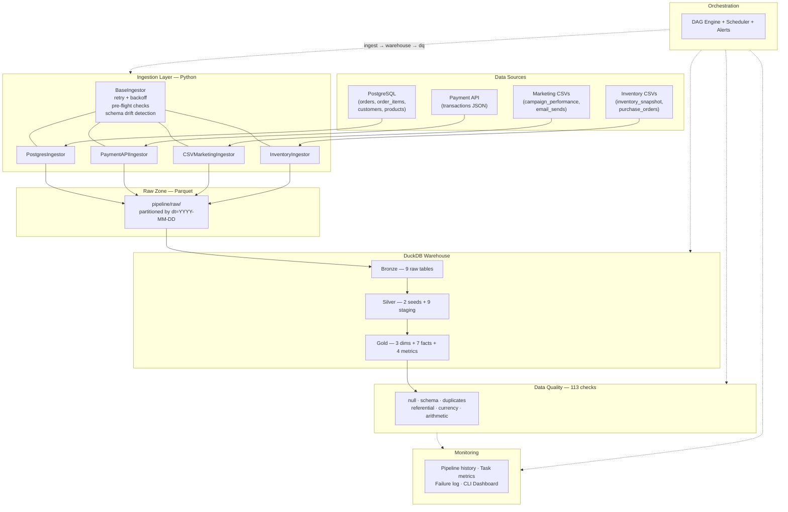
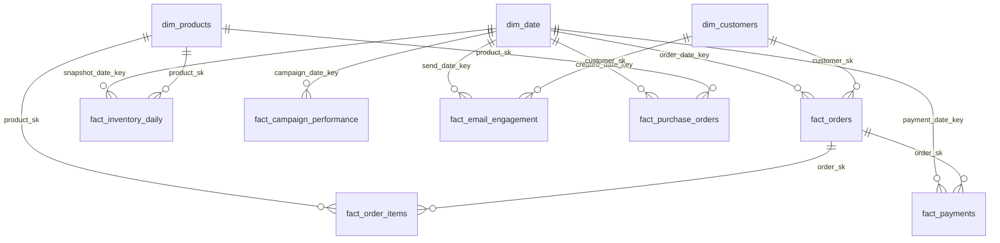

# E-Commerce Data Platform — Technical Documentation

> Generated: 2026-03-14 | Version: 1.0

---

## Table of Contents

1. [System Architecture](#1-system-architecture)
2. [Pipeline Documentation](#2-pipeline-documentation)
3. [Data Dictionary — Gold Layer](#3-data-dictionary--gold-layer)
4. [Source-to-Target Mapping](#4-source-to-target-mapping)

---

## 1. System Architecture

### 1.1 Architecture Diagram



### 1.2 Technology Stack

| Component | Technology | Purpose |
|---|---|---|
| Language | Python 3.12 | All pipeline code |
| Warehouse | DuckDB | Local analytical database |
| File format | Apache Parquet | Columnar raw zone storage |
| Data processing | pandas + pyarrow | Ingestion I/O |
| Orchestration | Custom DAG engine | Task scheduling, retries, dependencies |
| Quality | Custom DQ engine | 113 automated checks |
| Monitoring | CSV + JSON logs, CLI dashboard | Observability |

### 1.3 Directory Structure

```
pipeline/
├── run_pipeline.py          # Full pipeline entry point
├── run_ingestion.py         # Ingestion entry point
├── run_warehouse.py         # Warehouse build entry point
│
├── configs/
│   ├── ingestion_config.json    # Source→entity mapping, retry settings
│   └── alerts_config.json       # Email/Slack alert configuration
│
├── ingestion/
│   ├── base_ingestor.py         # Core: retry, schema detection, fail-fast
│   ├── postgres_ingestor.py     # PostgreSQL source (4 entities)
│   ├── payment_api_ingestor.py  # Payment API source (1 entity)
│   ├── csv_marketing_ingestor.py # Marketing CSVs (2 entities)
│   └── inventory_ingestor.py    # Inventory CSVs (2 entities)
│
├── warehouse/
│   ├── engine.py                # DuckDB SQL runner with template substitution
│   ├── warehouse.duckdb         # Database file
│   ├── bronze/01_load_all.sql   # Raw Parquet → Bronze tables
│   ├── silver/
│   │   ├── 01_seeds.sql         # Static lookups (categories, FX rates)
│   │   └── 02_staging.sql       # 9 cleaned/typed staging tables
│   └── gold/
│       ├── 01_dimensions.sql    # dim_date, dim_customers, dim_products
│       ├── 02_facts.sql         # 7 fact tables
│       └── 03_metrics.sql       # 4 metric/aggregate tables
│
├── quality/
│   ├── __init__.py              # DataQualityEngine (113 checks)
│   └── run_data_quality.py      # Standalone DQ entry point
│
├── orchestration/
│   ├── dag.py                   # DAG engine: topo sort, retries, status
│   ├── scheduler.py             # Daily scheduler (configurable UTC time)
│   └── alerts.py                # Multi-channel alerting (log/email/Slack)
│
├── monitoring/
│   ├── __init__.py              # PipelineMonitor: metrics persistence
│   └── dashboard.py             # CLI dashboard (ASCII tables + JSON)
│
├── raw/                         # Partitioned Parquet files
│   ├── postgres/{entity}/dt=YYYY-MM-DD/data.parquet
│   ├── payments/transactions/dt=YYYY-MM-DD/data.parquet
│   ├── marketing/{entity}/dt=YYYY-MM-DD/data.parquet
│   └── inventory/{entity}/dt=YYYY-MM-DD/data.parquet
│
└── logs/
    ├── pipeline_history.csv     # Per-run aggregates
    ├── task_history.csv         # Per-task detail (timing, attempts)
    ├── failure_log.csv          # Task failure records
    ├── ingestion_log.csv        # Per-entity ingestion records
    ├── ingestion_run.log        # Ingestion process output
    ├── warehouse_run.log        # Warehouse build output
    ├── pipeline_run.log         # Orchestration output
    ├── schema_registry.json     # Schema hash tracking for drift detection
    └── dq_reports/
        ├── dq_history.csv       # DQ summary per run
        └── dq_report_*.json     # Full check-level detail per run
```

---

## 2. Pipeline Documentation

### 2.1 Pipeline DAG

The pipeline executes three tasks in strict dependency order:

```
ingest  ──▶  build_warehouse  ──▶  data_quality
```

| Task | Module | Execution | Retries | Backoff |
|---|---|---|---|---|
| `ingest` | `pipeline.run_ingestion` | subprocess | 3 | 2s × 2.0 |
| `build_warehouse` | `pipeline.run_warehouse` | subprocess | 2 | 3s × 2.0 |
| `data_quality` | `pipeline.quality` | in-process | 1 | 1s × 1.0 |

**Failure behavior**: If a task fails after all retries, downstream tasks are marked `UPSTREAM_FAILED` and skipped. An alert is dispatched via configured channels.

### 2.2 Ingestion Layer

#### Overview

All ingestors inherit from `BaseIngestor`, which provides:

- **Pre-flight checks**: File exists, is a file (not directory), is readable, has non-zero size, partition date is valid (`YYYY-MM-DD`), entity name is non-empty
- **Fail-fast**: `FileNotFoundError`, `PermissionError`, `IsADirectoryError`, `IngestionError`, `ValueError`, `KeyError` bypass retries
- **Retry with backoff**: Configurable `max_retries`, `retry_delay`, `retry_backoff` (exponential multiplier)
- **Empty data guard**: Refuses to write DataFrames with 0 rows
- **Schema detection**: Computes SHA-256 hash of column names + dtypes; warns via log on drift compared to `schema_registry.json`
- **Logging**: Writes structured rows to `ingestion_log.csv` with run_id, entity, rows, schema hash, timestamps, duration

#### Ingestors

| Ingestor | Source Name | Entities | Input Format |
|---|---|---|---|
| `PostgresIngestor` | `postgres` | `orders`, `order_items`, `customers`, `products` | CSV |
| `PaymentAPIIngestor` | `payments` | `transactions` | JSON |
| `CSVMarketingIngestor` | `marketing` | `campaign_performance`, `email_sends` | CSV |
| `InventoryIngestor` | `inventory` | `inventory_snapshot`, `purchase_orders` | CSV |

#### Output

All ingestors write to the raw zone as Parquet files partitioned by date:
```
pipeline/raw/{source}/{entity}/dt={partition_date}/data.parquet
```

#### Configuration

`pipeline/configs/ingestion_config.json`:
```json
{
  "partition_date": "2026-03-10",
  "sources": {
    "postgres": { "orders": "orders_2026-03-10.csv", ... },
    "payments": { "transactions": "payment_transactions_2026-03-10.json" },
    "marketing": { "campaign_performance": "...", "email_sends": "..." },
    "inventory": { "inventory_snapshot": "...", "purchase_orders": "..." }
  },
  "retry": { "max_retries": 3, "retry_delay": 2, "retry_backoff": 2 }
}
```

### 2.3 Warehouse Layer (Medallion Architecture)

#### Bronze (1:1 Raw Load)

9 tables loaded directly from Parquet with no transformation:

| Bronze Table | Source |
|---|---|
| `bronze.raw_orders` | postgres/orders |
| `bronze.raw_order_items` | postgres/order_items |
| `bronze.raw_customers` | postgres/customers |
| `bronze.raw_products` | postgres/products |
| `bronze.raw_payment_transactions` | payments/transactions |
| `bronze.raw_campaign_performance` | marketing/campaign_performance |
| `bronze.raw_email_sends` | marketing/email_sends |
| `bronze.raw_inventory_snapshot` | inventory/inventory_snapshot |
| `bronze.raw_purchase_orders` | inventory/purchase_orders |

#### Silver (Cleaned + Typed)

**Seed tables** (static lookups):

| Seed Table | Purpose | Rows |
|---|---|---|
| `silver.seed_category_mapping` | Maps raw category strings → standardized names | 8 |
| `silver.seed_exchange_rates` | Currency → USD conversion rates | 2 |

**Staging tables** — transformations applied:

| Staging Table | Key Transformations |
|---|---|
| `stg_customers` | Email → `LOWER(TRIM(...))`, phone `.0` suffix removed, dedup by `customer_id`, `is_duplicate_email` flag |
| `stg_products` | Category → `LOWER(TRIM(...))` → joined to `seed_category_mapping`, `gross_margin_pct` computed |
| `stg_orders` | Status → `LOWER(TRIM(...))`, currency → `UPPER(TRIM(...))`, `has_total_mismatch` arithmetic flag |
| `stg_order_items` | `has_line_total_mismatch` flag: `|unit_price × qty - discount - line_total| > 0.01` |
| `stg_payment_transactions` | Method/type/status → `LOWER(TRIM(...))`, currency → `UPPER`, `failure_reason` → `NULLIF` empty |
| `stg_campaign_performance` | Platform/channel/device → `LOWER(TRIM(...))`, country → `UPPER` |
| `stg_email_sends` | Email → `LOWER(TRIM(...))`, boolean flag casting |
| `stg_inventory_snapshot` | Integer + decimal type casting |
| `stg_purchase_orders` | Status → `LOWER(TRIM(...))`, date type casting |

#### Gold (Star Schema)

3 dimension tables + 7 fact tables + 4 metric tables = **14 gold tables** (34 total across all layers, 1,590 rows).

See [Section 3: Data Dictionary](#3-data-dictionary--gold-layer) for full column-level detail.

### 2.4 Data Quality System

113 automated checks across 6 categories, run after every warehouse build:

| Category | Count | Description |
|---|---|---|
| **Null** | 60 | NOT NULL validation on PK + required columns across gold and silver |
| **Schema** | 9 | Column presence + type verification for all gold tables |
| **Duplicate** | 16 | Uniqueness on surrogate + natural keys |
| **Referential** | 13 | FK → PK orphan detection (0 orphans expected) |
| **Currency** | 3 | Order↔payment currency match, known FX rates, positive USD conversion |
| **Arithmetic** | 12 | Order totals, line totals, payment nets, gross profit, PO totals, non-negative amounts |

**Output**: JSON report + CSV summary per run in `pipeline/logs/dq_reports/`.

**Pipeline integration**: Wired as the `data_quality` task in the DAG. Fails the pipeline if any check fails.

### 2.5 Orchestration

- **DAG engine**: Kahn's algorithm for topological sort, cycle detection, dependency validation
- **Retries**: Per-task configurable with exponential backoff (`delay × backoff^attempt`)
- **Upstream failures**: Cascade to downstream tasks as `UPSTREAM_FAILED` (skipped)
- **Scheduler**: `DailyScheduler` runs at configurable UTC hour/minute (default 02:00)
- **Alerts**: Multi-channel — always logs, optionally emails (SMTP/TLS) or posts to Slack webhook

### 2.6 Monitoring

| Log File | Content | Granularity |
|---|---|---|
| `pipeline_history.csv` | Run timestamp, tasks total/succeeded/failed, duration | Per pipeline run |
| `task_history.csv` | Task ID, status, start/end time, duration, attempts, error | Per task per run |
| `failure_log.csv` | Failed task ID, status, attempts, error message | Per failure |
| `ingestion_log.csv` | Source, entity, rows ingested, schema hash, duration | Per entity per run |
| `schema_registry.json` | Last-known column hash per source/entity | Updated on change |
| `dq_reports/dq_history.csv` | Total/passed/failed check counts | Per DQ run |
| `dq_reports/dq_report_*.json` | Full check-by-check results | Per DQ run |

**CLI Dashboard**: `python -m pipeline.monitoring.dashboard`

| Flag | Effect |
|---|---|
| _(none)_ | Full dashboard (all 5 sections) |
| `--section runs` | Pipeline run history only |
| `--section tasks` | Per-task runtime metrics + averages |
| `--section failures` | Failure log |
| `--section ingestion` | Ingestion volumes by source |
| `--section dq` | Data quality trends |
| `--json` | Raw JSON output (all data) |

### 2.7 Running the Pipeline

```bash
# Full pipeline (single run)
python pipeline/run_pipeline.py

# Scheduled mode (daily at 03:30 UTC)
python pipeline/run_pipeline.py --schedule --hour 3 --minute 30

# Individual components
python -m pipeline.run_ingestion
python -m pipeline.run_warehouse
python -m pipeline.quality.run_data_quality

# Monitoring dashboard
python -m pipeline.monitoring.dashboard
python -m pipeline.monitoring.dashboard --section dq
python -m pipeline.monitoring.dashboard --json
```

---

## 3. Data Dictionary — Gold Layer

### 3.1 Dimension Tables

#### `gold.dim_date`

Pre-generated calendar spine (2024-01-01 to 2027-12-31). 1,461 rows.

| Column | Type | Description |
|---|---|---|
| `date_key` | INTEGER | Surrogate key in YYYYMMDD format |
| `full_date` | DATE | Calendar date |
| `day_of_week` | INTEGER | ISO day of week (1=Monday … 7=Sunday) |
| `day_name` | VARCHAR | English day name ("Monday", etc.) |
| `week_of_year` | INTEGER | ISO week number (1–53) |
| `month_num` | INTEGER | Month number (1–12) |
| `month_name` | VARCHAR | English month name ("January", etc.) |
| `quarter` | INTEGER | Calendar quarter (1–4) |
| `year` | INTEGER | Calendar year |
| `is_weekend` | BOOLEAN | True for Saturday/Sunday |
| `fiscal_quarter` | INTEGER | Fiscal quarter (fiscal year starts July) |
| `fiscal_year` | INTEGER | Fiscal year (July start) |

#### `gold.dim_customers`

Deduplicated customer master. Groups customers by email; earliest `customer_id` per email becomes `canonical_customer_id`. SCD Type 2 ready. 4 rows.

| Column | Type | Description |
|---|---|---|
| `customer_sk` | INTEGER | Surrogate key (auto-incremented) |
| `customer_id` | INTEGER | Source system customer ID |
| `canonical_customer_id` | INTEGER | Earliest customer_id for this email address |
| `email` | VARCHAR | Lowercased, trimmed email address |
| `first_name` | VARCHAR | First name |
| `last_name` | VARCHAR | Last name |
| `phone` | VARCHAR | Phone number (trailing `.0` removed) |
| `country_code` | VARCHAR | ISO country code (uppercased) |
| `status` | VARCHAR | Account status (lowercased) |
| `marketing_opt_in` | BOOLEAN | Email marketing consent flag |
| `created_at` | TIMESTAMP | Account creation timestamp |
| `is_duplicate_email` | BOOLEAN | True if this email has multiple customer_ids |
| `is_current` | BOOLEAN | SCD2: true = current record |
| `valid_from` | TIMESTAMP | SCD2: record validity start |
| `valid_to` | TIMESTAMP | SCD2: record validity end (NULL = current) |
| `_loaded_at` | TIMESTAMPTZ | ETL load timestamp |

#### `gold.dim_products`

Product catalog with standardized categories and computed margins. 4 rows.

| Column | Type | Description |
|---|---|---|
| `product_sk` | INTEGER | Surrogate key |
| `product_id` | INTEGER | Source product ID |
| `sku` | VARCHAR | Stock-keeping unit code |
| `product_name` | VARCHAR | Product display name |
| `category_raw` | VARCHAR | Original category string from source |
| `category_standardized` | VARCHAR | Standardized via `seed_category_mapping` |
| `brand` | VARCHAR | Brand name |
| `unit_cost` | DECIMAL(18,2) | Cost per unit |
| `list_price` | DECIMAL(18,2) | Listed retail price |
| `gross_margin_pct` | DOUBLE | `(list_price - unit_cost) / list_price × 100` |
| `is_active` | BOOLEAN | Active product flag |
| `created_at` | TIMESTAMP | Product creation timestamp |
| `_loaded_at` | TIMESTAMPTZ | ETL load timestamp |

### 3.2 Fact Tables

#### `gold.fact_orders`

**Grain**: One row per order. 5 rows.

| Column | Type | Description |
|---|---|---|
| `order_sk` | INTEGER | Surrogate key |
| `order_id` | INTEGER | Source order ID (natural key) |
| `customer_sk` | INTEGER | FK → `dim_customers.customer_sk` |
| `order_date_key` | INTEGER | FK → `dim_date.date_key` |
| `order_status` | VARCHAR | Order status (completed, cancelled, pending, etc.) |
| `currency` | VARCHAR | Original currency code (USD, PHP) |
| `subtotal_amount` | DECIMAL(18,2) | Pre-discount subtotal |
| `discount_amount` | DECIMAL(18,2) | Discount applied |
| `shipping_amount` | DECIMAL(18,2) | Shipping charge |
| `tax_amount` | DECIMAL(18,2) | Tax amount |
| `total_amount` | DECIMAL(18,2) | Final total (original currency) |
| `total_amount_usd` | DECIMAL(18,2) | Total converted to USD via `seed_exchange_rates` |
| `payment_status` | VARCHAR | Payment status (paid, pending, voided) |
| `is_cancelled` | BOOLEAN | `order_status = 'cancelled'` |
| `is_paid` | BOOLEAN | `payment_status = 'paid'` |
| `has_total_mismatch` | BOOLEAN | True if `|subtotal - discount + shipping + tax - total| > 0.01` |
| `updated_at` | TIMESTAMP | Last update timestamp |
| `_loaded_at` | TIMESTAMPTZ | ETL load timestamp |

**Business rules**:
- `total_amount_usd = total_amount × rate_to_usd` (from `seed_exchange_rates`)
- Arithmetic identity: `subtotal - discount + shipping + tax ≈ total (±0.01)`

#### `gold.fact_order_items`

**Grain**: One row per order line item. 5 rows.

| Column | Type | Description |
|---|---|---|
| `order_item_sk` | INTEGER | Surrogate key |
| `order_item_id` | INTEGER | Source line item ID (natural key) |
| `order_sk` | INTEGER | FK → `fact_orders.order_sk` |
| `product_sk` | INTEGER | FK → `dim_products.product_sk` |
| `quantity` | INTEGER | Quantity ordered |
| `unit_price` | DECIMAL(18,2) | Selling price per unit |
| `discount_amount` | DECIMAL(18,2) | Line-level discount |
| `line_total` | DECIMAL(18,2) | Final line amount |
| `unit_cost` | DECIMAL(18,2) | Cost per unit (from `dim_products`) |
| `gross_profit` | DECIMAL(18,2) | `line_total − (unit_cost × quantity)` |
| `has_line_total_mismatch` | BOOLEAN | True if `|unit_price × qty - discount - line_total| > 0.01` |
| `_loaded_at` | TIMESTAMPTZ | ETL load timestamp |

#### `gold.fact_payments`

**Grain**: One row per payment transaction. 5 rows.

| Column | Type | Description |
|---|---|---|
| `payment_sk` | INTEGER | Surrogate key |
| `transaction_id` | VARCHAR | Provider transaction ID (natural key) |
| `order_sk` | INTEGER | FK → `fact_orders.order_sk` |
| `customer_sk` | INTEGER | FK → `dim_customers.customer_sk` |
| `payment_date_key` | INTEGER | FK → `dim_date.date_key` |
| `payment_method` | VARCHAR | Payment method (card, etc.) |
| `transaction_type` | VARCHAR | capture, refund, void, authorization |
| `status` | VARCHAR | succeeded, failed, pending |
| `currency` | VARCHAR | Original currency code |
| `gross_amount` | DECIMAL(18,2) | Total charge amount |
| `fee_amount` | DECIMAL(18,2) | Processing fee |
| `net_amount` | DECIMAL(18,2) | Amount after fees |
| `gross_amount_usd` | DECIMAL(18,2) | Gross amount in USD |
| `card_brand` | VARCHAR | Card brand (visa, mastercard, etc.) |
| `card_country` | VARCHAR | Card issuing country |
| `failure_reason` | VARCHAR | Failure reason (nullable) |
| `is_refund` | BOOLEAN | From source `refund_flag` |
| `is_successful` | BOOLEAN | `status = 'succeeded'` |
| `_loaded_at` | TIMESTAMPTZ | ETL load timestamp |

**Business rules**:
- For capture transactions: `net_amount = gross_amount − fee_amount`
- For void/authorization: `net_amount = 0` (no money moved)

#### `gold.fact_inventory_daily`

**Grain**: One row per SKU × warehouse × snapshot date. 4 rows.

| Column | Type | Description |
|---|---|---|
| `inventory_sk` | INTEGER | Surrogate key |
| `snapshot_date_key` | INTEGER | FK → `dim_date.date_key` |
| `product_sk` | INTEGER | FK → `dim_products.product_sk` |
| `warehouse_id` | INTEGER | Warehouse identifier |
| `on_hand_qty` | INTEGER | Total on-hand quantity |
| `reserved_qty` | INTEGER | Reserved/allocated quantity |
| `available_qty` | INTEGER | Available for sale |
| `reorder_point` | INTEGER | Reorder threshold |
| `is_below_reorder` | BOOLEAN | `available_qty < reorder_point` |
| `inventory_value` | DECIMAL(18,2) | `on_hand_qty × unit_cost` |
| `_loaded_at` | TIMESTAMPTZ | ETL load timestamp |

#### `gold.fact_campaign_performance`

**Grain**: One row per campaign × platform × country × device × day. 3 rows.

| Column | Type | Description |
|---|---|---|
| `campaign_perf_sk` | INTEGER | Surrogate key |
| `campaign_date_key` | INTEGER | FK → `dim_date.date_key` |
| `platform` | VARCHAR | Ad platform (meta, google, tiktok) |
| `campaign_id` | VARCHAR | Campaign identifier |
| `campaign_name` | VARCHAR | Campaign display name |
| `channel` | VARCHAR | Marketing channel (paid_social, paid_search) |
| `country_code` | VARCHAR | Target country |
| `device_type` | VARCHAR | Device type (mobile, desktop) |
| `impressions` | INTEGER | Ad impressions |
| `clicks` | INTEGER | Ad clicks |
| `spend` | DECIMAL(18,2) | Ad spend amount |
| `conversions` | INTEGER | Conversion count |
| `reported_revenue` | DECIMAL(18,2) | Platform-reported revenue |
| `ctr` | DOUBLE | Click-through rate (`clicks / impressions`) |
| `cpc` | DOUBLE | Cost per click (`spend / clicks`) |
| `cpa` | DOUBLE | Cost per acquisition (`spend / conversions`) |
| `roas` | DOUBLE | Return on ad spend (`revenue / spend`) |
| `_loaded_at` | TIMESTAMPTZ | ETL load timestamp |

#### `gold.fact_email_engagement`

**Grain**: One row per email send per recipient. 3 rows.

| Column | Type | Description |
|---|---|---|
| `email_sk` | INTEGER | Surrogate key |
| `send_date_key` | INTEGER | FK → `dim_date.date_key` |
| `campaign_id` | VARCHAR | Email campaign identifier |
| `campaign_name` | VARCHAR | Campaign display name |
| `customer_sk` | INTEGER | FK → `dim_customers.customer_sk` |
| `delivery_status` | VARCHAR | delivered, bounced |
| `is_delivered` | BOOLEAN | `delivery_status = 'delivered'` |
| `is_opened` | BOOLEAN | Recipient opened email |
| `is_clicked` | BOOLEAN | Recipient clicked link |
| `is_unsubscribed` | BOOLEAN | Recipient unsubscribed |
| `_loaded_at` | TIMESTAMPTZ | ETL load timestamp |

#### `gold.fact_purchase_orders`

**Grain**: One row per PO line. 3 rows.

| Column | Type | Description |
|---|---|---|
| `po_sk` | INTEGER | Surrogate key |
| `po_id` | INTEGER | Purchase order ID (natural key) |
| `supplier_id` | INTEGER | Supplier identifier |
| `product_sk` | INTEGER | FK → `dim_products.product_sk` |
| `created_date_key` | INTEGER | FK → `dim_date.date_key` |
| `expected_delivery_date` | DATE | Expected arrival date |
| `ordered_qty` | INTEGER | Quantity ordered |
| `received_qty` | INTEGER | Quantity received so far |
| `unit_cost` | DECIMAL(18,2) | Cost per unit |
| `po_total` | DECIMAL(18,2) | `ordered_qty × unit_cost` |
| `po_status` | VARCHAR | open, partial, received |
| `fill_rate` | DOUBLE | `received_qty / ordered_qty` |
| `is_overdue` | BOOLEAN | Past expected date and not fully received |
| `_loaded_at` | TIMESTAMPTZ | ETL load timestamp |

### 3.3 Metric Tables

#### `gold.metric_customer_lifetime_value`

**Grain**: One row per canonical customer. 4 rows.

| Column | Type | Description |
|---|---|---|
| `canonical_customer_id` | INTEGER | Deduplicated customer identifier |
| `first_name` | VARCHAR | First name |
| `last_name` | VARCHAR | Last name |
| `email` | VARCHAR | Email address |
| `country_code` | VARCHAR | Country code |
| `total_orders` | BIGINT | All orders (including cancelled) |
| `completed_orders` | BIGINT | Non-cancelled orders |
| `lifetime_revenue_usd` | DECIMAL(38,2) | Cumulative USD revenue |
| `avg_order_value_usd` | DOUBLE | Revenue / completed orders |
| `lifetime_discount` | DECIMAL(38,2) | Total discounts received |
| `first_order_date` | DATE | First order date |
| `last_order_date` | DATE | Most recent order date |
| `customer_tenure_days` | BIGINT | Days between first and last order |
| `days_since_last_order` | BIGINT | Recency (days since last order) |
| `estimated_clv_90d` | DOUBLE | 90-day CLV estimate = AOV × purchase frequency |
| `_computed_at` | TIMESTAMPTZ | Computation timestamp |

#### `gold.metric_order_conversion_rate`

**Grain**: One row per order date. 1 row.

| Column | Type | Description |
|---|---|---|
| `order_date` | DATE | Calendar date |
| `total_orders` | BIGINT | All orders placed |
| `non_cancelled_orders` | BIGINT | Orders not cancelled |
| `paid_orders` | BIGINT | Orders with `payment_status = 'paid'` |
| `cancelled_orders` | BIGINT | Cancelled orders |
| `total_gmv_usd` | DECIMAL(38,2) | Gross merchandise value in USD |
| `paid_revenue_usd` | DECIMAL(38,2) | Revenue from paid orders only |
| `non_cancel_rate` | DOUBLE | Non-cancel / total |
| `payment_conversion_rate` | DOUBLE | Paid / total |
| `cancellation_rate` | DOUBLE | Cancelled / total |
| `_computed_at` | TIMESTAMPTZ | Computation timestamp |

#### `gold.metric_revenue_by_campaign`

**Grain**: One row per campaign. 4 rows. 7-day attribution window via email engagement.

| Column | Type | Description |
|---|---|---|
| `campaign_id` | VARCHAR | Campaign identifier |
| `campaign_name` | VARCHAR | Campaign display name |
| `total_sends` | BIGINT | Email sends |
| `delivered` | BIGINT | Successfully delivered |
| `opened` | BIGINT | Emails opened |
| `clicked` | BIGINT | Emails clicked |
| `total_spend` | DECIMAL(38,2) | Paid ad spend |
| `total_impressions` | HUGEINT | Ad impressions |
| `paid_clicks` | HUGEINT | Ad clicks |
| `total_conversions` | HUGEINT | Ad conversions |
| `paid_reported_revenue` | DECIMAL(38,2) | Platform-reported revenue |
| `attributed_orders` | BIGINT | Orders from campaign contacts (7-day window) |
| `attributed_revenue_usd` | DECIMAL(38,2) | Revenue from attributed orders |
| `attributed_roas` | DOUBLE | Attributed revenue / spend |
| `_computed_at` | TIMESTAMPTZ | Computation timestamp |

#### `gold.metric_inventory_turnover`

**Grain**: One row per product. 4 rows.

| Column | Type | Description |
|---|---|---|
| `product_sk` | INTEGER | FK → `dim_products` |
| `product_id` | INTEGER | Source product ID |
| `sku` | VARCHAR | SKU code |
| `product_name` | VARCHAR | Product name |
| `category_standardized` | VARCHAR | Standardized category |
| `units_sold` | HUGEINT | Units sold (non-cancelled orders) |
| `total_sales_revenue` | DECIMAL(38,2) | Total revenue |
| `total_gross_profit` | DECIMAL(38,2) | Total gross profit |
| `total_on_hand` | HUGEINT | Current on-hand across warehouses |
| `total_available` | HUGEINT | Available across warehouses |
| `total_reserved` | HUGEINT | Reserved across warehouses |
| `any_below_reorder` | BOOLEAN | Any warehouse below reorder point |
| `total_inventory_value` | DECIMAL(38,2) | Cost value of inventory |
| `inventory_turnover_ratio` | DOUBLE | COGS / inventory value |
| `days_of_supply` | DOUBLE | On-hand / daily sell rate |
| `incoming_supply_qty` | HUGEINT | Incoming from open POs |
| `open_po_count` | BIGINT | Number of open purchase orders |
| `_computed_at` | TIMESTAMPTZ | Computation timestamp |

### 3.4 Relationship Diagram



---

## 4. Source-to-Target Mapping

### 4.1 Source → Bronze (1:1)

| Source File | Bronze Table |
|---|---|
| `orders_2026-03-10.csv` | `bronze.raw_orders` |
| `order_items_2026-03-10.csv` | `bronze.raw_order_items` |
| `customers_2026-03-10.csv` | `bronze.raw_customers` |
| `products_2026-03-10.csv` | `bronze.raw_products` |
| `payment_transactions_2026-03-10.json` | `bronze.raw_payment_transactions` |
| `campaign_performance_2026-03-10.csv` | `bronze.raw_campaign_performance` |
| `email_sends_2026-03-10.csv` | `bronze.raw_email_sends` |
| `inventory_snapshot_2026-03-10.csv` | `bronze.raw_inventory_snapshot` |
| `purchase_orders_2026-03-10.csv` | `bronze.raw_purchase_orders` |

### 4.2 Bronze → Silver (Cleaned + Typed)

| Bronze Source | Silver Target | Key Transformations |
|---|---|---|
| `raw_orders` | `stg_orders` | Status/currency normalization, decimal casting, `has_total_mismatch` flag |
| `raw_order_items` | `stg_order_items` | SKU/name trim, decimal casting, `has_line_total_mismatch` flag |
| `raw_customers` | `stg_customers` | Email lowercase, phone `.0` removal, dedup by `customer_id`, `is_duplicate_email` |
| `raw_products` | `stg_products` | Category standardization (via `seed_category_mapping`), `gross_margin_pct` |
| `raw_payment_transactions` | `stg_payment_transactions` | Method/type/status lowercase, failure_reason `NULLIF`, timestamp cast |
| `raw_campaign_performance` | `stg_campaign_performance` | Platform/channel/device lowercase, integer/decimal casting |
| `raw_email_sends` | `stg_email_sends` | Email lowercase, boolean flag casting |
| `raw_inventory_snapshot` | `stg_inventory_snapshot` | Date/integer/decimal type casting |
| `raw_purchase_orders` | `stg_purchase_orders` | Status lowercase, date/numeric type casting |

### 4.3 Silver → Gold (Star Schema)

#### Dimensions

| Gold Target | Silver Source(s) | Join Logic | Key Derivations |
|---|---|---|---|
| `dim_date` | _(generated)_ | Calendar spine 2024–2027 | `date_key = YYYYMMDD`, fiscal year (July start) |
| `dim_customers` | `stg_customers` | All rows | `canonical_customer_id = MIN(customer_id) OVER (PARTITION BY email)`, SCD2 fields |
| `dim_products` | `stg_products` | All rows | `category_standardized` from seed join, `gross_margin_pct` |

#### Facts

| Gold Target | Silver Source(s) | Join Logic | Key Derivations |
|---|---|---|---|
| `fact_orders` | `stg_orders` + `dim_customers` + `dim_date` + `seed_exchange_rates` | `customer_id → canonical → customer_sk`, `order_date → date_key` | `total_amount_usd`, `is_cancelled`, `is_paid` |
| `fact_order_items` | `stg_order_items` + `fact_orders` + `dim_products` | `order_id → order_sk`, `product_id → product_sk` | `unit_cost` from dim, `gross_profit = line_total - unit_cost × qty` |
| `fact_payments` | `stg_payment_transactions` + `fact_orders` + `dim_customers` + `dim_date` + `seed_exchange_rates` | `order_id → order_sk`, `customer_id → canonical → customer_sk` | `gross_amount_usd`, `is_refund`, `is_successful` |
| `fact_inventory_daily` | `stg_inventory_snapshot` + `dim_products` + `dim_date` | `product_id → product_sk`, `snapshot_date → date_key` | `is_below_reorder`, `inventory_value = on_hand × unit_cost` |
| `fact_campaign_performance` | `stg_campaign_performance` + `dim_date` | `campaign_date → date_key` | `ctr`, `cpc`, `cpa`, `roas` (computed ratios) |
| `fact_email_engagement` | `stg_email_sends` + `dim_customers` + `dim_date` | `customer_id → canonical → customer_sk`, `send_date → date_key` | `is_delivered`, `is_opened`, `is_clicked`, `is_unsubscribed` |
| `fact_purchase_orders` | `stg_purchase_orders` + `dim_products` + `dim_date` | `sku → product_sk`, `created_at → date_key` | `po_total`, `fill_rate`, `is_overdue` |

#### Metrics

| Gold Target | Upstream Gold Source(s) | Aggregation Logic |
|---|---|---|
| `metric_customer_lifetime_value` | `fact_orders` + `dim_customers` + `dim_date` | Group by `canonical_customer_id`; sum revenue, count orders, compute AOV, tenure, recency, 90-day CLV |
| `metric_order_conversion_rate` | `fact_orders` + `dim_date` | Group by `order_date`; count statuses, compute conversion/cancellation rates |
| `metric_revenue_by_campaign` | `fact_email_engagement` + `fact_orders` + `fact_campaign_performance` | Join email→orders within 7-day window; aggregate sends, spend, attributed revenue, ROAS |
| `metric_inventory_turnover` | `dim_products` + `fact_order_items` + `fact_inventory_daily` + `fact_purchase_orders` | Per product: units sold, COGS, on-hand, turnover ratio, days of supply |

### 4.4 Complete Column-Level Lineage: `fact_orders`

Example end-to-end lineage for the central fact table:

| Gold Column | Silver Column | Bronze Column | Source Column | Transformation |
|---|---|---|---|---|
| `order_sk` | _(generated)_ | — | — | `ROW_NUMBER()` |
| `order_id` | `stg_orders.order_id` | `raw_orders.order_id` | `orders.order_id` | `CAST(... AS INTEGER)` |
| `customer_sk` | `stg_orders.customer_id` → `dim_customers` | `raw_orders.customer_id` | `orders.customer_id` | Join via `canonical_customer_id` |
| `order_date_key` | `stg_orders.order_date` → `dim_date` | `raw_orders.order_date` | `orders.order_date` | `CAST(STRFTIME(order_date, '%Y%m%d') AS INTEGER)` |
| `currency` | `stg_orders.currency` | `raw_orders.currency` | `orders.currency` | `UPPER(TRIM(...))` |
| `total_amount` | `stg_orders.total_amount` | `raw_orders.total_amount` | `orders.total_amount` | `CAST(... AS DECIMAL(18,2))` |
| `total_amount_usd` | `stg_orders.total_amount` × `seed_exchange_rates.rate_to_usd` | — | — | Cross-currency conversion |
| `is_cancelled` | _(derived)_ | — | — | `order_status = 'cancelled'` |
| `is_paid` | _(derived)_ | — | — | `payment_status = 'paid'` |
| `has_total_mismatch` | `stg_orders.has_total_mismatch` | — | — | Computed in Silver: `|subtotal - discount + shipping + tax - total| > 0.01` |

---

_End of documentation._
